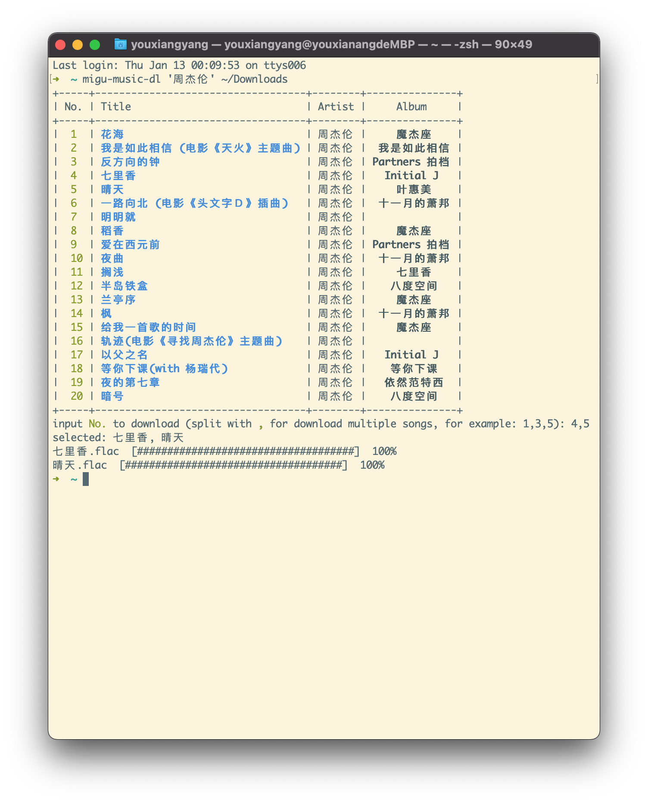

# MIGU-Music-dl   

[](https://badge.fury.io/py/migu-music-dl)
[](https://github.com/swim2sun/migu-music-dl/actions/workflows/publish.yml)

Download Migu Lossless Music

## Installation

### Install from PyPI

```shell
$ pip install migu-music-dl
```

### Install from Homebrew
```shell
$ brew tap swim2sun/migu-music-dl
$ brew install migu-music-dl
```
    

Usage
-----

```shell
$ migu-music-dl [OPTIONS] SEARCH_KEYWORD OUTPUT_DIR
```

