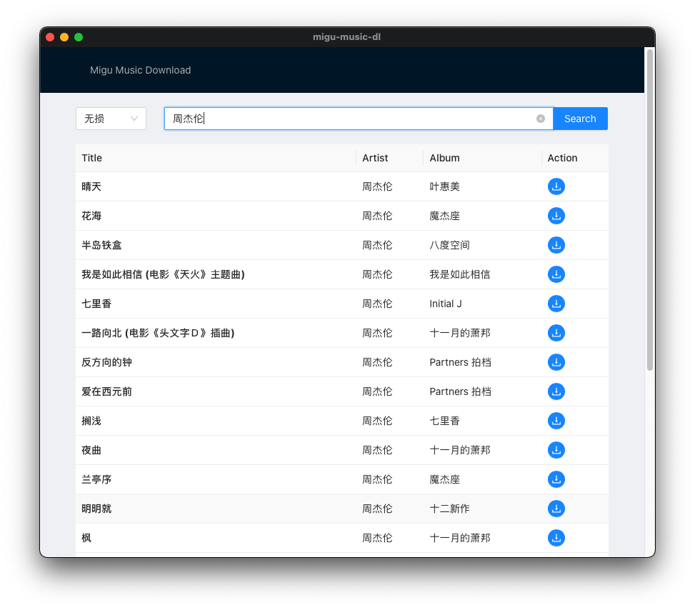

# MIGU-Music-dl   
[](https://github.com/swim2sun/migu-music-dl/actions/workflows/publish.yml) 
[](https://github.com/swim2sun/migu-music-dl/issues)
[](https://github.com/swim2sun/migu-music-dl/network)
[](https://github.com/swim2sun/migu-music-dl/stargazers)
[](https://github.com/swim2sun/migu-music-dl)


Download Migu Lossless Music



## Installation

Download from [releases](https://github.com/swim2sun/migu-music-dl/releases) 

## Deployment

start tauri
```
npm run tauri dev
```

build
```
npm run build
```
